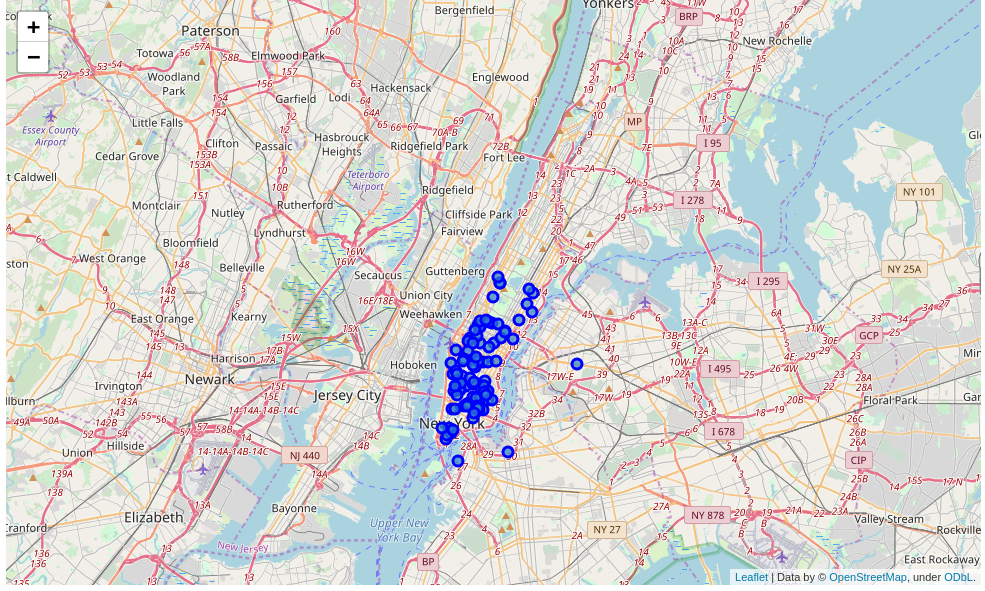
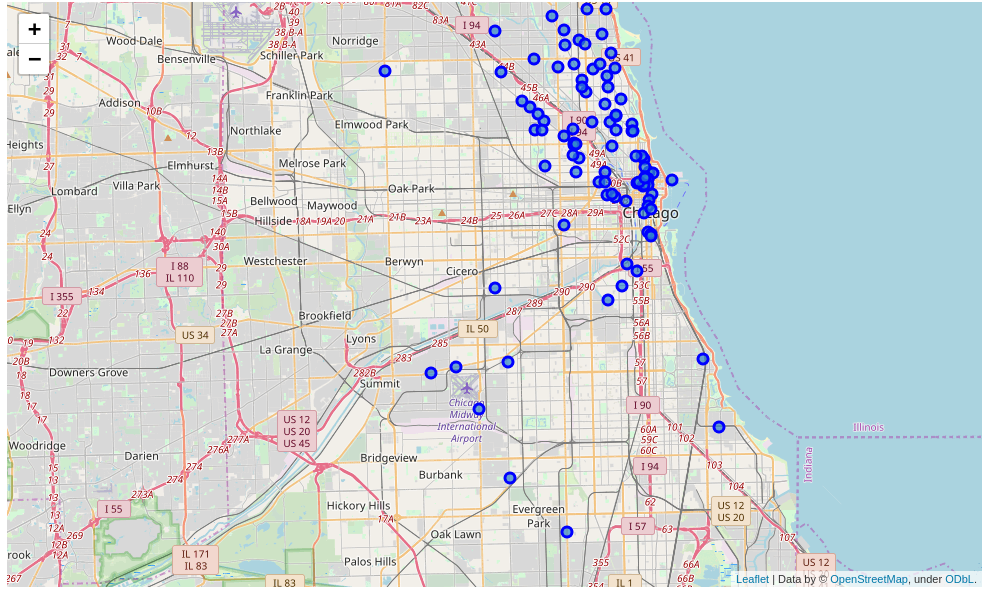
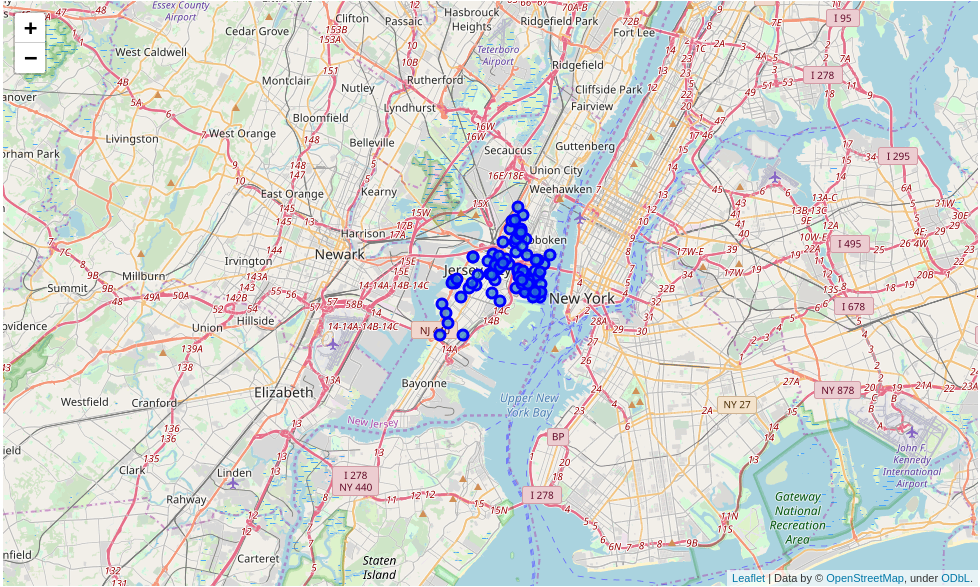
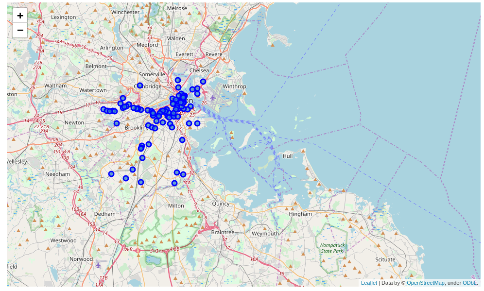
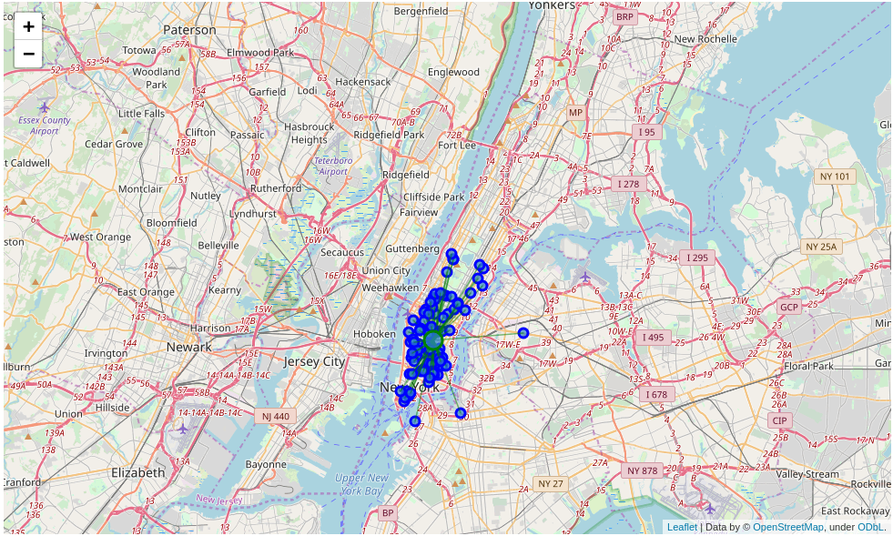
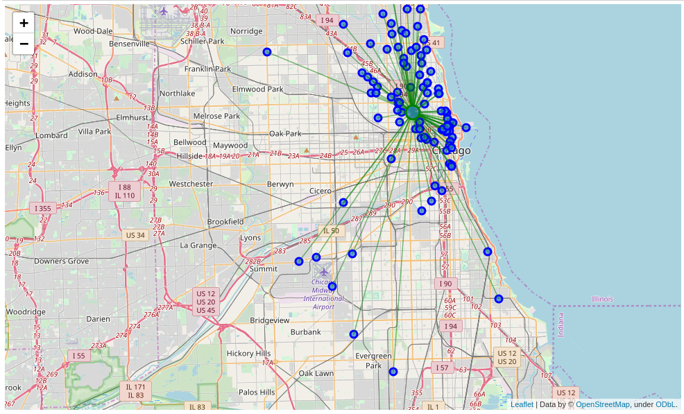
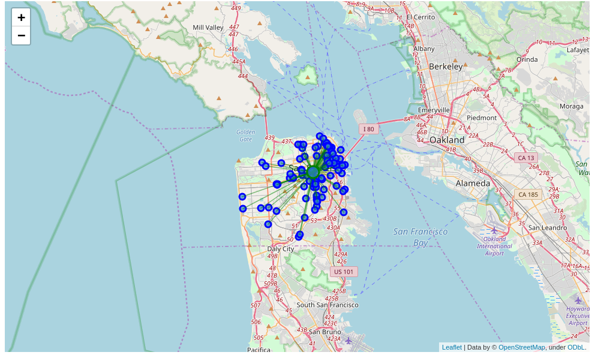
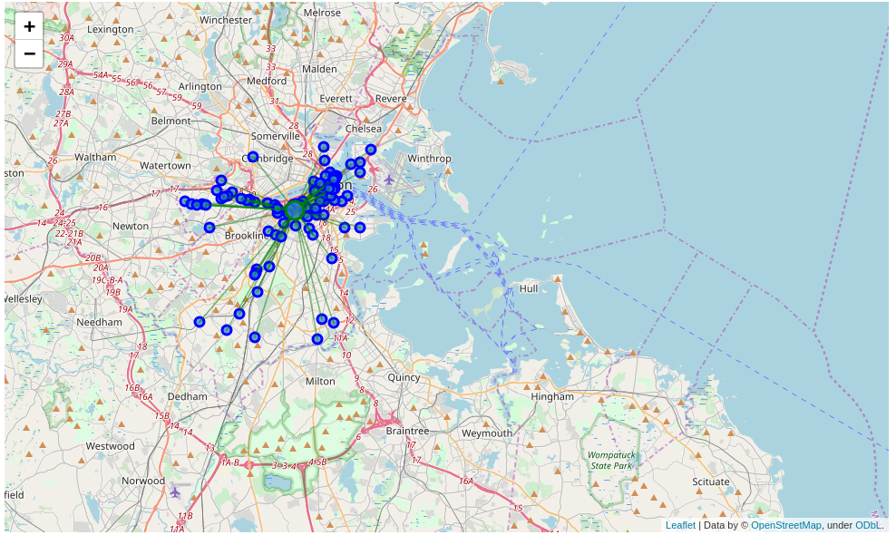

# Where to Go When You Want to Eat Pizza ? 

*Data Science Capstone - IBM Data Science Professional Certificate on Coursera*

## Introduction 

Let's say you have never been to the US and you want to have only pizza while you are there. So you want to go to a place with a high density of Pizza places around you. The problem we aim to solve is to analyze the Pizza stores' locations in the major US cities and find the best place for our tourist so that he can have a good pizz-ourism. Our main target are tourists with a taste of western-style pizza

## Data section 

I will use the FourSquare API to collect data about locations of Pizza stores in 5 major US cities which are: New York,NY, San Francisco, CA, Jersey City, NJ,  Boston, MA and Chicago,IL. These are one of the most populated US cities and I am hopeful that they will contain the best Pizza places in the US. 

## Methodology 

My main target here is to asses which city would have the highest Pizza store density. I used the Four Square API through the venues channel. I used the near query to get venues in the cities. Also, I use the CategoryID to set it to show only Pizza Places. An Example of my requests: 

` https://api.foursquare.com/v2/venues/explore?&client_id=&client_secret=&v=20180605&New York, NY&limit=100&categoryId=4bf58dd8d48988d1ca941735`

That 4bf58dd8d48988d1ca941735 is the Id of the Pizza Place Category. Also, Foursquare limits us to maximum of 100 venues per query.

Moreover, I repeated this request for the 5 studied cities and got their top 100 venues. I saved the name and coordinate data only from the result and plotted them on the map for visual inspection. 

Next, to get an indicator of the density of Pizza Places, I calculated a center coordinate of the venues to get the mean longitude and latitude values.  Then I calculated the mean of the Euclidean distance from each venue to the mean coordinates. That was my indicator; mean distance to the mean coordinate. 

## Results

For our initial visual inspection we see that they all have multiple pizza places and often more than Foursquare would like to supply us. The following here are the pictures of the geoplot generated with folium:

#### New York:

#### Chicago:

#### San Francisco: 

#### Jersey City:

#### Boston: 

Upon First inspection we see that New York, Jersey City and San Francisco are the most densely cities. In the next phase we Calculate the Mean coordinate and the mean distance to mean coordinate(MDMC). We represent the mean coordinate with a big green circle and distances with green lines

#### New York: 

MDMC: 0.021556

#### Chicago: 

MDMC: 0.052805

#### San Francisco: 

MDMC: 0.028633

#### Jersey City:

MDMC: 0.029950

####  Boston: 

MDMC: 0.035126

Therefore our results are : 

1. New York
2. San Francisco
3. Jersey City
4. Boston 
5. Chicago

## Discussion:

One thing I noticed in the figure is that there is a really far away Pizza Store in Jersey City that is probably giving it a higher MDMC. So I cheched what if I removed it, it would not harm anyone to try 99 pizza places than 100 and New York is just at the other shore. 

The new MDMC was: 0.0219953, putting it one place up on the list replacing San Francisco. 

One consideration to do further work on is to move the location of the Foursquare API query until we get all the pizza places in each city and do the calculations again. 

## Conclusion:

Now there is no doubt that New York is the best place to try many Pizza Places in the US. Also, if our tourist is done with all the New York pizza places he can cross to Jersey City and enjoy 99 more.  	

Also, we would recommend that our tourist book a hotel close to the mean coordinate. 
